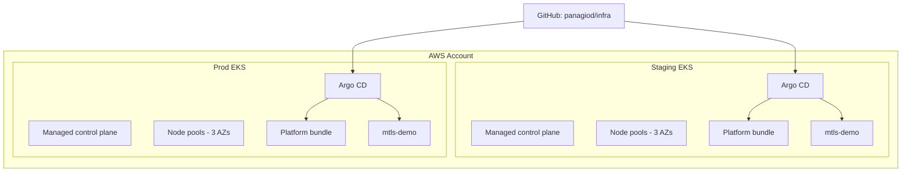
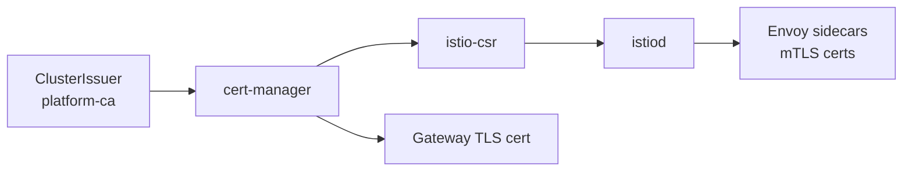

# Architecture

## Goals

- Production-ready managed Kubernetes on AWS (EKS)
- Staging and prod clusters with identical platform behavior
- mTLS everywhere via Istio
- Certificates issued and rotated by cert-manager (istio-csr for mesh, ClusterIssuer for ingress)
- GitOps-driven platform lifecycle with Argo CD
- Foundation for future multi-cloud expansion (GCP, Azure)

## Cluster topology

## Platform bundle (install order)

Argo CD sync waves enforce bootstrap order:

| Wave | Component | Namespace |
|------|-----------|-----------|
| 0 | cert-manager | cert-manager |
| 1 | ClusterIssuer + mesh CA | cert-manager |
| 2 | Istio base | istio-system |
| 3 | istiod | istio-system |
| 4 | istio-csr | cert-manager |
| 5 | Gateway API CRDs + Istio gateway | istio-system |
| 6 | PeerAuthentication STRICT default | istio-system |
| 7 | kube-prometheus-stack | monitoring |
| 8 | Kyverno policies | kyverno |
| 9 | mtls-demo app | mtls-demo |

## Certificate flow

Phase 1 uses a **platform CA ClusterIssuer** (cert-manager `selfSigned` bootstrap → `CA` issuer). Replace with your custom cert-manager provider backed by KMS/HSM without changing the mesh layout. See [cert-manager-provider.md](cert-manager-provider.md).

## Networking

- VPC with public subnets (load balancers) and private subnets (nodes)
- NAT gateway per AZ in prod; single NAT in staging (cost optimization)
- EKS API endpoint: private + public (restrict public CIDRs in prod `terraform.tfvars`)
- AWS Load Balancer Controller installed for Istio/Gateway service type LoadBalancer

## Identity

- **IRSA** (IAM Roles for Service Accounts) for:
  - AWS Load Balancer Controller
  - cert-manager (Route53 DNS-01 when configured)
  - cluster-autoscaler
- **Mesh identity:** Istio SPIFFE IDs via istio-csr-issued certificates

## Observability

- Prometheus scrapes Kubernetes, Istio, and cert-manager metrics
- Grafana dashboards for mesh and cert expiry
- Alertmanager routes (configure receivers in overlay)
- Staging and prod each run a full stack; future phase may add centralized Mimir/Loki

## Security baseline

- Istio `PeerAuthentication` STRICT in `istio-system` (root policy)
- Kyverno: require Istio injection label on demo namespaces
- Pod Security: namespaces labeled `pod-security.kubernetes.io/enforce: restricted` where compatible
- Private worker nodes; no SSH by default

## State and blast radius

- Separate Terraform state per environment (`staging`, `prod`)
- Separate EKS clusters (no shared etcd)
- Separate platform CA intermediates per cluster (via cert-manager)

## Upgrade strategy

1. Bump Kubernetes version in staging Terraform → apply → roll node groups
2. Soak staging; run synthetic checks on mtls-demo
3. Bump platform Helm versions in `gitops/platform/` staging overlay
4. Promote Terraform + GitOps changes to prod
5. Document versions in [upgrades.md](upgrades.md)
