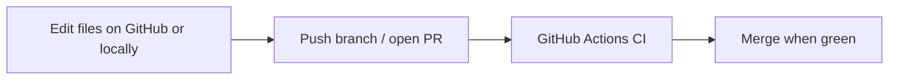

# Option B — contribute with CI only (no cluster)

Improve this repo **without** running kind, Codespaces, or any cloud account. GitHub Actions validates every pull request.

Use this path when you:

- Have **no Codespaces quota** left
- Want to change **Terraform** or **GitOps manifests** only
- Prefer editing in the **GitHub web UI**

Combine with **Option A** ([codespaces.md](codespaces.md)) when you want a hands-on lab — they work together.

---

## How it works



| Step | You do | Automation |
|------|--------|------------|
| 1 | Create branch `feat/my-change` from `main` | — |
| 2 | Edit `gitops/` and/or `terraform/` | — |
| 3 | Open pull request | CI triggers on changed paths |
| 4 | Fix any red checks | Re-push; duplicate runs cancel (saves minutes) |
| 5 | Merge | Done — no cluster to tear down |

**No cloud credentials** are required for manifest validation or `terraform validate` (backend disabled in CI).

---

## Edit on GitHub (browser only)

1. Open `https://github.com/panagiod/infra`
2. Switch to branch **`main`** → **Fork** if you don't have write access
3. Click a file (e.g. under `gitops/`) → **Edit** (pencil icon)
4. GitHub offers **“Create a new branch for this commit”** — name it `feat/my-change`
5. **Commit changes** → **Create pull request**

Repeat edits on the same branch; each push re-runs CI.

---

## What CI runs

| Workflow | Triggers when you change | What it does | Typical time |
|----------|--------------------------|--------------|--------------|
| [gitops.yml](../.github/workflows/gitops.yml) | `gitops/**` | `kustomize build` all overlays | ~1–2 min |
| [kind-smoke.yml](../.github/workflows/kind-smoke.yml) | `gitops/**`, bootstrap scripts | Ephemeral kind cluster + full bootstrap | ~15–30 min |
| [terraform.yml](../.github/workflows/terraform.yml) | `terraform/**` | `terraform fmt` + `validate` | ~3–5 min |
| [terraform-plan.yml](../.github/workflows/terraform-plan.yml) | `terraform/**` (AWS) | Plan against AWS — **needs OIDC vars** | ~5 min |
| [terraform-plan-azure.yml](../.github/workflows/terraform-plan-azure.yml) | `terraform/**` (Azure) | Plan against Azure — **needs OIDC vars** | ~5 min |

**Kind smoke is the slowest** — it only runs when GitOps-related files change. Docs-only PRs skip it.

Plan workflows are **optional** until you configure OIDC — `terraform validate` still runs without cloud access.

---

## Pre-push check (optional)

Run the same validation locally or in a Codespace **before** opening a PR:

```bash
chmod +x scripts/ci-validate.sh
./scripts/ci-validate.sh
```

Only checks what changed vs `main` by default:

```bash
# Force all checks
RUN_TERRAFORM=true RUN_GITOPS=true ./scripts/ci-validate.sh
```

---

## Tips to save Actions minutes

- **Batch commits** — one push instead of many (each push can re-trigger)
- **Draft PRs** while iterating; mark **Ready for review** when you want full attention on CI
- **Avoid touching `gitops/**`** if you only change docs — kind-smoke won't run
- Duplicate runs on the same PR are **cancelled automatically** (`concurrency`)

See [quota-automation.md](quota-automation.md) for full quota details.

---

## Example: change a GitOps value

1. Branch `feat/gateway-hostname`
2. Edit `gitops/clusters/staging/cluster.env` (e.g. gateway hostname)
3. Open PR → **GitOps manifests** + **Kind smoke** run
4. Wait for green checks → merge

No kubectl, no Docker, no AWS.

---

## Example: change Terraform

1. Branch `fix/node-group-size`
2. Edit `terraform/environments/staging/main.tf`
3. Open PR → **Terraform** runs `fmt` + `validate`
4. Merge when green

---

## When you need Option A

| Goal | Use |
|------|-----|
| See Argo CD UI, poke pods, learn the platform | [codespaces.md](codespaces.md) → `./scripts/start-lab.sh` |
| Debug why kind-smoke failed interactively | Codespaces lab with same bootstrap scripts |
| Validate manifests only | Option B (this doc) |

---

## Related

- [getting-started.md](getting-started.md) — A + B golden path
- [quota-automation.md](quota-automation.md) — shutdown and CI minute guards
- [pull request template](../.github/pull_request_template.md) — PR checklist
