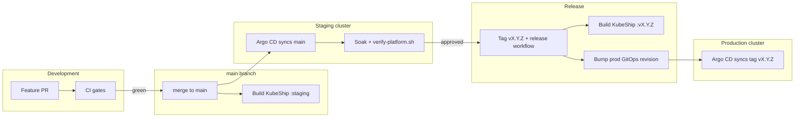

# Delivery path: CI → staging → production

How changes move from a pull request to production clusters **without skipping validation**.

## Overview



## Environments

| Environment | Cluster | Git revision | KubeShip image | Who updates |
|-------------|---------|--------------|----------------|-------------|
| **CI (Kind)** | Ephemeral per PR | PR branch | `ghcr.io/.../kubeship:staging` (built + loaded in workflow) | GitHub Actions |
| **Staging** | EKS/AKS staging | `main` | `ghcr.io/panagiod/infra/kubeship:staging` | Push to `main` |
| **Production** | EKS/AKS prod | **Git tag** `vX.Y.Z` | `ghcr.io/panagiod/infra/kubeship:vX.Y.Z` | Release workflow |

**Rule:** Production never tracks floating `main`. It tracks an **immutable tag** you promote after staging soak.

## Stage 1 — Pull request (every change)

| Gate | Workflow | What it proves |
|------|----------|----------------|
| Fast preflight | `gitops.yml` | Kustomize, install order, images, kubeconform |
| KubeShip sanity | `kubeship.yml` | Go API lifecycle, UI routes, validation (in-memory store) |
| Terraform | `terraform.yml` | fmt + validate |
| Full platform | `kind-smoke.yml` | Ephemeral cluster boots full stack including KubeShip |

**Merge policy:** all required checks green. No direct pushes to `main` without PR (branch protection recommended).

## Stage 2 — Staging (continuous from `main`)

After merge to `main`:

1. **GitOps** — staging Argo CD Applications with label `infra.platform/git-source=true` sync `GITOPS_TARGET_REVISION=main` from `gitops/clusters/staging/cluster.env`.
2. **KubeShip image** — `.github/workflows/build-kubeship-staging.yml` builds and pushes `ghcr.io/panagiod/infra/kubeship:staging` when `apps/kubeship/` changes. Staging Argo CD uses overlay `gitops/apps/kubeship/overlays/cloud-staging` (GHCR `:staging` tag).
3. **Verify** — on cloud staging:
   ```bash
   ENVIRONMENT=staging ./scripts/verify-platform.sh
   ```

Staging is the **soak environment**. Run it here before any production promotion.

## Stage 3 — Production promotion (release tag)

Production uses a **pinned Git tag**, not `main`.

### One-time setup

1. GitHub → **Settings → Environments** → create `production` (optional approval gate).
2. Ensure GHCR can push from Actions (`packages: write`).

### Promote a release

When staging is healthy and you are ready for production:

```bash
# From GitHub UI: Actions → Release to production → Run workflow
# Enter version: 1.0.0   (creates tag v1.0.0)
```

Or locally (maintainer):

```bash
gh workflow run release.yml -f version=1.0.0
```

The **Release to production** workflow:

1. Verifies `apps/kubeship/` and GitOps paths exist on `main`.
2. Builds and pushes `ghcr.io/panagiod/infra/kubeship:v1.0.0`.
3. Updates `gitops/apps/kubeship/overlays/prod/kustomization.yaml` image tag.
4. Updates `gitops/clusters/prod/cluster.env` → `GITOPS_TARGET_REVISION=v1.0.0`.
5. Commits, tags `v1.0.0`, pushes commit + tag.

Production Argo CD then syncs **exactly that tag** — immutable, auditable, rollback-friendly.

### Rollback production

```bash
# Re-run release workflow with previous version, OR:
git checkout v1.0.0 -- gitops/clusters/prod/cluster.env gitops/apps/kubeship/overlays/prod/
git commit -m "rollback: prod to v1.0.0"
git tag v1.0.1  # new forward tag pointing at rollback state
```

Or revert the release commit on `main` and cut a new tag.

## What syncs automatically vs manually

| Item | Staging | Production |
|------|---------|------------|
| Platform Helm charts (`targetRevision: '*'`) | Latest on sync | Latest at **tagged** revision |
| Git-backed apps (KubeShip, Couchbase config) | `main` | Tag `vX.Y.Z` |
| KubeShip container image | `:staging` on each `main` build | `:vX.Y.Z` on release only |
| Terraform (EKS/AKS) | `terraform apply` staging | `terraform apply` prod (separate) |

Platform Terraform and GitOps are **independent**: cluster exists before Argo syncs apps.

## Couchbase and backing services

Backing services (Couchbase, future Redis/Kafka) follow the **same Git revision** as the cluster:

- Staging Couchbase config: `main`
- Production Couchbase config: promoted **with the same tag** as KubeShip

Do not upgrade production Couchbase independently of a tagged release without a documented runbook entry.

## Checklist before first production release

- [ ] Staging cloud cluster bootstrapped (`bootstrap-aws.sh` or `bootstrap-azure.sh`)
- [ ] `verify-platform.sh` green on staging
- [ ] Couchbase admin password rotated (not `changeme-staging`)
- [ ] Grafana / Alertmanager secrets configured for prod
- [ ] Branch protection on `main` with required checks
- [ ] First release: `gh workflow run release.yml -f version=0.1.0`

## Checklist for every release

- [ ] Kind smoke green on `main`
- [ ] Staging soak complete (your judgment + verify script)
- [ ] Release notes / LinkedIn update (optional)
- [ ] Run `release.yml` with new semver
- [ ] Confirm prod Argo CD: `kubeship` + `couchbase` Applications Synced/Healthy
- [ ] `ENVIRONMENT=prod ./scripts/verify-platform.sh`

## Related docs

- [ci-only.md](ci-only.md) — PR validation without a cluster
- [verify.md](verify.md) — post-deploy health checks
- [upgrades.md](upgrades.md) — component upgrades
- [kubeship.md](kubeship.md) — application details
- [project-status.md](project-status.md) — what is lab vs production-proven
