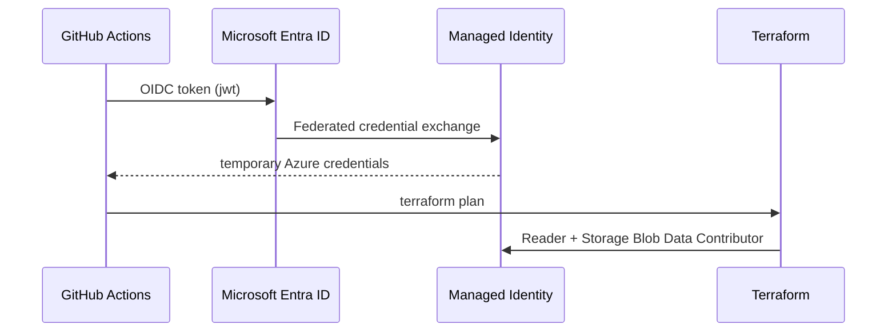

# GitHub Actions — Azure OIDC for Terraform plan

Run **`terraform plan`** on pull requests that touch Azure Terraform without storing long-lived Azure credentials in GitHub Secrets.

## Architecture



## One-time setup

### 1. Create remote state storage

Use an Azure Storage account and blob container for Terraform state (see [azure.md](../bootstrap/azure.md) or `scripts/bootstrap-azure.sh` with `CREATE_STATE=true`).

### 2. Apply the OIDC bootstrap stack

```bash
cd terraform/bootstrap/azure-github-oidc
cp terraform.tfvars.example terraform.tfvars
# Set subscription_id, github_org, github_repo, and state storage names
terraform init
terraform apply
```

Copy outputs into GitHub repository **Variables**:

| Name | Source |
|------|--------|
| `AZURE_CLIENT_ID` | `github_actions_client_id` output |
| `AZURE_TENANT_ID` | `tenant_id` output |
| `AZURE_SUBSCRIPTION_ID` | `subscription_id` output |
| `TF_STATE_RG` | Resource group of the state storage account |
| `TF_STATE_STORAGE_ACCOUNT` | Storage account name |
| `TF_STATE_CONTAINER` | Blob container name (default `tfstate`) |

Repository → **Settings** → **Secrets and variables** → **Actions** → **Variables**.

### 3. Confirm workflow permissions

The workflow `.github/workflows/terraform-plan-azure.yml` requires:

- `id-token: write` — mint OIDC token
- `contents: read` — checkout code
- `pull-requests: write` — post plan comment

### 4. Open a PR

Change any file under `terraform/environments/azure/` or `terraform/modules/azure/`. The **Terraform plan (Azure)** workflow runs `terraform plan` and comments on the PR.

## Federated credential subject

By default the bootstrap stack trusts:

```text
repo:<org>/<repo>:pull_request
```

To allow plans from `main` pushes or environment-scoped workflows, set `github_subject` in `terraform.tfvars` when applying the bootstrap stack.

## Security notes

- The managed identity is scoped to **Reader** on the subscription plus **Storage Blob Data Contributor** on the state storage account.
- **`terraform apply` is not run from Actions** — apply stays manual or via a separate protected workflow.
- Tighten `api_server_authorized_ip_ranges` in environment `terraform.tfvars` for production clusters.

## Troubleshooting

| Symptom | Fix |
|---------|-----|
| Workflow skipped | Set `AZURE_CLIENT_ID` and `TF_STATE_STORAGE_ACCOUNT` repository variables |
| `AADSTS700213` federated login error | Verify `github_subject` matches the workflow trigger (PR vs branch) |
| State access denied | Confirm `Storage Blob Data Contributor` on the correct storage account |
| Plan fails on missing vars | Ensure `terraform.tfvars.example` includes required values copied in CI |
