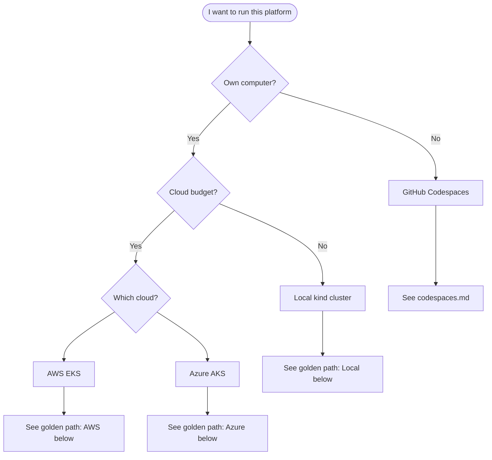

# Getting started

Choose your path based on what you have available.

- **No own machine?** → [Codespaces](codespaces.md) (browser lab) or [CI-only](#golden-path-contribute-without-a-cluster) below
- **Own machine, no cloud budget?** → [local development](local-dev.md)
- **Cloud account?** → AWS or Azure paths below

## Which path should I use?



| Situation | Start here |
|-----------|------------|
| No computer / browser only | [codespaces.md](codespaces.md) |
| No AWS/Azure account (have Docker locally) | [local-dev.md](local-dev.md) |
| AWS account + Terraform state | [QUICKSTART.md](QUICKSTART.md) |
| Azure subscription + storage for state | [azure.md](azure.md) |
| Understanding the design | [architecture.md](architecture.md) |
| What's done vs what's lab-only | [project-status.md](project-status.md) |
| After bootstrap — health checks | [verify.md](verify.md) |
| Save quota (auto-shutdown) | [quota-automation.md](quota-automation.md) |

---

## Golden path: A + B (Codespaces lab + CI) — recommended

**No own machine.** Use Codespaces for hands-on work; CI validates every PR automatically.

### A — Start the lab (Codespaces)

1. GitHub → **Code** → **Codespaces** → **Create codespace on main**
2. Terminal:

```bash
./scripts/start-lab.sh
```

### B — Contribute (automatic on every PR)

1. Branch from `main` (`feat/`, `fix/`, `docs/`)
2. Edit `gitops/` or `terraform/` (GitHub web UI or in the codespace)
3. Optional: `./scripts/ci-validate.sh` before pushing
4. Open PR → CI runs automatically (kustomize, kind-smoke, terraform validate)

Full walkthrough: [ci-only.md](ci-only.md)

### Shutdown — save quota (important)

```bash
STOP_CODESPACE=true ./scripts/shutdown-lab.sh
```

**Automatic:** codespace stops after **15 min idle** or **2 h max**; kind cluster is deleted on stop.

Details: [codespaces.md](codespaces.md) · [ci-only.md](ci-only.md) · [quota-automation.md](quota-automation.md)

---

## Golden path: local ($0, own machine)

**Time:** ~15 minutes first sync (Docker + kind + full platform).

**You need:** Docker, [kind](https://kind.sigs.k8s.io/), kubectl, Helm.

```bash
# 1. Bootstrap
chmod +x scripts/bootstrap-local.sh
./scripts/bootstrap-local.sh

# 2. Verify (wait until Argo CD finishes syncing if needed)
LOCAL=true ./scripts/verify-platform.sh

# 3. Explore
kubectl -n argocd port-forward svc/argocd-server 8080:80
# http://localhost:8080
```

**Test your Git changes:**

```bash
git push origin feat/my-branch
GITOPS_REVISION=feat/my-branch RECREATE_CLUSTER=true ./scripts/bootstrap-local.sh
```

**Tear down:**

```bash
DESTROY=true ./scripts/bootstrap-local.sh
```

Details: [local-dev.md](local-dev.md)

---

## Golden path: AWS

**You need:** AWS account, S3 + DynamoDB for Terraform state, AWS CLI, Terraform, kubectl.

```bash
export TF_STATE_BUCKET="your-org-terraform-state"
export TF_LOCK_TABLE="your-org-terraform-locks"
export AWS_REGION="us-east-1"

chmod +x scripts/bootstrap-aws.sh
./scripts/bootstrap-aws.sh

./scripts/verify-platform.sh
```

One-time CI setup (optional, needs state bucket):

```bash
./scripts/setup-github-oidc-aws.sh
```

Details: [QUICKSTART.md](QUICKSTART.md) · Deep manual steps: [bootstrap.md](bootstrap.md)

---

## Golden path: Azure

**You need:** Azure subscription, Storage account for state, Azure CLI, Terraform, kubectl.

```bash
export TF_STATE_RG="infra-tfstate-rg"
export TF_STATE_STORAGE_ACCOUNT="yourorgtfstate"
export AZURE_REGION="westeurope"

chmod +x scripts/bootstrap-azure.sh
./scripts/bootstrap-azure.sh

./scripts/verify-platform.sh   # after az aks get-credentials (script does this)
```

Details: [azure.md](azure.md) · OIDC for PR plans: [github-actions-azure-oidc.md](github-actions-azure-oidc.md)

---

## Golden path: contribute without a cluster

**Option B** — no Docker, no Codespaces, no cloud:

1. Branch from `main` (`feat/`, `fix/`, `chore/`, `docs/`)
2. Edit `gitops/` or `terraform/` on github.com or locally
3. Open a PR — CI runs:
   - `terraform fmt` + `validate`
   - `kustomize build` on GitOps paths
   - **Kind smoke** (ephemeral cluster) on `gitops/**` changes

Optional pre-push: `./scripts/ci-validate.sh`

**Full guide:** [ci-only.md](ci-only.md)

---

## What happens after bootstrap?

Regardless of path, the same GitOps bundle deploys:

| Step | Component | Purpose |
|------|-----------|---------|
| 0 | cert-manager | TLS automation |
| 1 | platform-ca | Internal CA for mesh |
| 2–5 | Istio + gateway + ingress TLS | Service mesh + HTTPS ingress |
| 6 | mTLS STRICT policies | Encrypt mesh traffic |
| 7 | Prometheus + Grafana | Metrics |
| 8 | Kyverno | Policy guardrails |
| 9 | mtls-demo | Sample app to prove mTLS |

Full order: [architecture.md](architecture.md#platform-bundle-install-order)

---

## Common next steps

| Goal | Doc |
|------|-----|
| Verify health | [verify.md](verify.md) |
| Configure alerts | [alerting.md](alerting.md) |
| Replace bootstrap CA | [cert-manager-provider.md](cert-manager-provider.md) |
| Upgrade K8s or platform | [upgrades.md](upgrades.md) |
| GitOps repo/branch config | `gitops/clusters/<env>/cluster.env` |

---

## Troubleshooting

| Problem | Where to look |
|---------|---------------|
| Apps stuck `Progressing` in Argo CD | [verify.md](verify.md) — wait 10–15 min, re-run |
| Kind out of memory | [local-dev.md](local-dev.md#troubleshooting) |
| Terraform plan workflow skipped | [github-actions-aws-oidc.md](github-actions-aws-oidc.md) |
| LoadBalancer pending on kind | MetalLB section in [local-dev.md](local-dev.md) |
