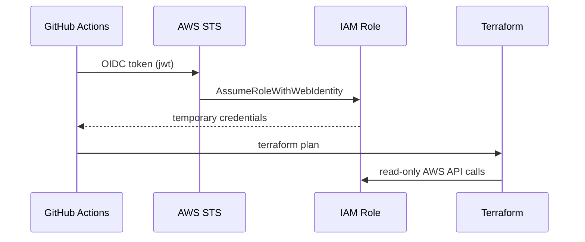

# GitHub Actions — AWS OIDC for Terraform plan

Run **`terraform plan`** on pull requests without storing long-lived AWS access keys in GitHub Secrets.

## Architecture



## One-time setup

### Option A: automated script (recommended)

```bash
export TF_STATE_BUCKET="your-org-terraform-state"
export TF_LOCK_TABLE="your-org-terraform-locks"
export AWS_REGION="us-east-1"
chmod +x scripts/setup-github-oidc-aws.sh
./scripts/setup-github-oidc-aws.sh
```

The script applies the bootstrap stack and sets GitHub repository variables.

### Option B: manual apply

```bash
cd terraform/bootstrap/aws-github-oidc
cp terraform.tfvars.example terraform.tfvars
# Set github_org, github_repo, state bucket names, etc.
terraform init
terraform apply
```

Copy the output `github_actions_role_arn` into a GitHub repository **Variable**:

| Name | Example |
|------|---------|
| `AWS_ROLE_ARN` | `arn:aws:iam::123456789012:role/infra-github-actions-plan` |
| `AWS_REGION` | `us-east-1` |
| `TF_STATE_BUCKET` | `your-org-terraform-state` |
| `TF_LOCK_TABLE` | `your-org-terraform-locks` |

Repository → **Settings** → **Secrets and variables** → **Actions** → **Variables**.

### Confirm workflow permissions

The workflow `.github/workflows/terraform-plan.yml` requires:

- `id-token: write` — mint OIDC token
- `contents: read` — checkout code
- `pull-requests: write` — post plan comment (optional)

### 3. Open a PR

Change any file under `terraform/environments/staging` or `prod`. The **Terraform plan** workflow runs `terraform plan` and comments on the PR.

## Security notes

- The IAM role trusts only your GitHub org/repo (and optionally branch patterns).
- Plan permissions are **scoped read** for EKS/VPC/IAM describe APIs plus S3/DynamoDB state access — not account-wide `ReadOnlyAccess`.
- **`terraform apply` is not run from Actions** — apply stays manual or via a separate protected workflow.

## Troubleshooting

| Symptom | Fix |
|---------|-----|
| `Could not assume role` | Check `AWS_ROLE_ARN` variable and trust policy `sub` claim |
| `AccessDenied` on S3 state | Add state bucket ARN to IAM policy in bootstrap module |
| Plan skipped | Workflow only runs when `terraform/environments/{staging,prod}/**` changes |
