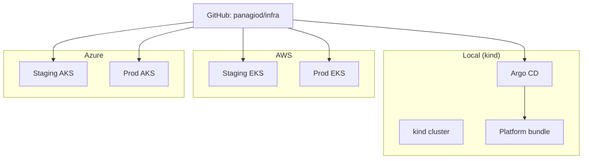
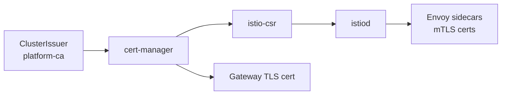

# Architecture

## Goals

- Managed Kubernetes on **AWS (EKS)**, **Azure (AKS)**, and **local kind** for zero-cost dev
- Staging and prod clusters with identical **GitOps** platform behavior
- mTLS everywhere via Istio
- Certificates issued and rotated by cert-manager (istio-csr for mesh, ClusterIssuer for ingress)
- GitOps-driven platform lifecycle with Argo CD

## Cluster topology

Each environment syncs the same `gitops/platform/` tree; only Terraform (networking + cluster bootstrap) differs by cloud.

## Platform bundle (install order)

Bootstrap order matches `scripts/gitops-install-order.sh` and is enforced in **Kind smoke** by wave-by-wave Application materialization (`wait-for-app.sh` / `wait-for-apps.sh`; see [mechanics.md](../bootstrap/mechanics.md)). On real clusters, **cluster-root** syncs all child Application CRs from Git; Argo CD does not use `spec.dependsOn` on Application CRs.

| # | Argo CD Application | Namespace |
|---|---------------------|-----------|
| 1 | cert-manager | cert-manager |
| 2 | platform-ca | cert-manager |
| 3 | istio-base | istio-system |
| 4 | istio-csr | cert-manager |
| 5 | istiod | istio-system |
| 6 | istio-gateway | istio-system |
| 7 | istio-ingress-tls | istio-system |
| 8 | istio-policies | istio-system |
| 9 | monitoring | monitoring |
| 10 | monitoring-alerts | monitoring |
| 11 | kyverno | kyverno |
| 12 | platform-policies | cluster-scoped |
| 13 | couchbase-config | couchbase |
| 14 | couchbase | couchbase |
| 15 | kubeship | kubeship |

Kind smoke groups these into dependency waves (for example wave 6: `istio-gateway` + `istio-policies`). See [mechanics.md](../bootstrap/mechanics.md) and `.github/workflows/kind-smoke.yml`.

## Certificate flow

Phase 1 uses a **platform CA ClusterIssuer** (bootstrap self-signed → CA issuer). Replace with your PKI without changing the mesh layout. See [cert-manager-provider.md](../operations/cert-manager-provider.md).

## Networking

| Cloud | Pattern |
|-------|---------|
| **AWS** | VPC with public/private subnets, NAT (single in staging), ALB controller |
| **Azure** | VNet + AKS subnet; Azure LB for `LoadBalancer` services |
| **Local** | kind + MetalLB for LoadBalancer IPs |

Restrict Kubernetes API access in prod via `cluster_endpoint_public_access_cidrs` (AWS) or `api_server_authorized_ip_ranges` (Azure).

## Identity

| Cloud | Cluster integrations | Mesh |
|-------|---------------------|------|
| **AWS** | IRSA for LB controller, autoscaler, EBS CSI | istio-csr |
| **Azure** | AKS managed identity; node pool autoscaling | istio-csr |
| **Local** | N/A | istio-csr |

## Observability

- Prometheus scrapes Kubernetes, Istio, and cert-manager metrics
- Grafana dashboards; Alertmanager routes (configure receivers — see [alerting.md](../operations/alerting.md))
- Certificate expiry alerts in `gitops/platform/monitoring/alerts/`

## Security baseline

- Istio `PeerAuthentication` STRICT in `istio-system`
- Kyverno: require Istio injection on workload namespaces (e.g. kubeship)
- Separate Terraform state and platform CA per environment
- Lab defaults (open API CIDRs, bootstrap CA) — tighten before production

## State and blast radius

- Separate Terraform state per environment and cloud
- Separate clusters (no shared control plane)
- Shared GitOps repo; per-env overlays in `gitops/clusters/` and `gitops/platform/*/overlays/`

## Upgrade strategy

See [upgrades.md](../operations/upgrades.md). Promote staging → prod after soak and `verify-platform.sh`.
