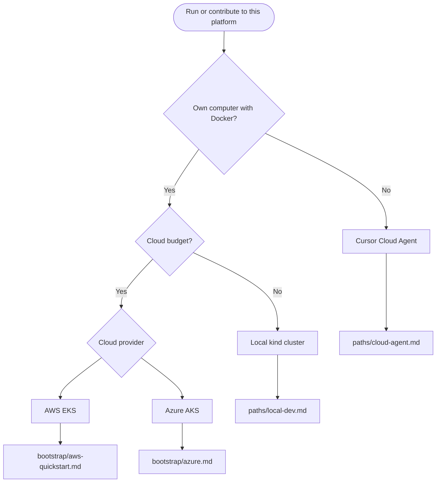

# Getting started

This page routes you to the correct documentation path. Detailed procedures live in the linked documents; they are not repeated here.

## Decision guide

## Path selection

| Your situation | Start here |
|----------------|------------|
| No local machine; use Cursor agent | [paths/cloud-agent.md](../paths/cloud-agent.md) |
| Browser-only lab (Codespaces) | [paths/codespaces.md](../paths/codespaces.md) |
| No cluster; edit and open PR | [paths/ci-only.md](../paths/ci-only.md) |
| Local Docker; zero cloud cost | [paths/local-dev.md](../paths/local-dev.md) |
| AWS account and Terraform state | [bootstrap/aws-quickstart.md](../bootstrap/aws-quickstart.md) |
| Azure subscription and remote state | [bootstrap/azure.md](../bootstrap/azure.md) |
| Understand platform design | [reference/architecture.md](../reference/architecture.md) |
| Phase-1 scope and maturity | [reference/project-status.md](../reference/project-status.md) |

## After bootstrap

| Goal | Document |
|------|----------|
| Verify cluster health | [operations/verify.md](../operations/verify.md) |
| Promote releases to production | [delivery/release-pipeline.md](../delivery/release-pipeline.md) |
| Configure alerting | [operations/alerting.md](../operations/alerting.md) |
| Replace bootstrap CA | [operations/cert-manager-provider.md](../operations/cert-manager-provider.md) |
| Upgrade components | [operations/upgrades.md](../operations/upgrades.md) |
| Reduce Codespaces or CI cost | [operations/quota-automation.md](../operations/quota-automation.md) |

## Platform install order

The GitOps bundle deploys the same components on every cluster. The authoritative install order and rationale are documented in [reference/architecture.md](../reference/architecture.md#platform-bundle-install-order).

Kind smoke and local ordered bootstrap enforce that order via dependency waves; see [bootstrap/mechanics.md](../bootstrap/mechanics.md).

## Troubleshooting index

| Symptom | Document |
|---------|----------|
| Argo CD Applications stuck in `Progressing` | [operations/verify.md](../operations/verify.md) |
| kind cluster out of memory | [paths/local-dev.md](../paths/local-dev.md#troubleshooting) |
| LoadBalancer pending on kind | [paths/local-dev.md](../paths/local-dev.md) |
| Terraform plan workflow skipped on PR | [delivery/github-actions-aws-oidc.md](../delivery/github-actions-aws-oidc.md) or [delivery/github-actions-azure-oidc.md](../delivery/github-actions-azure-oidc.md) |
